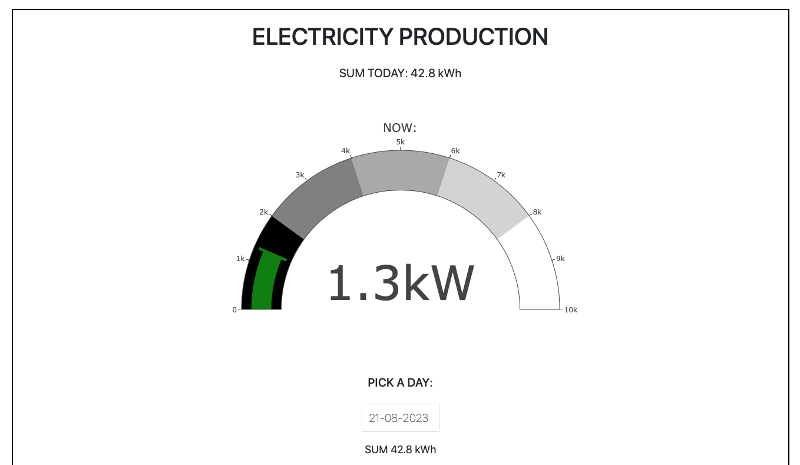
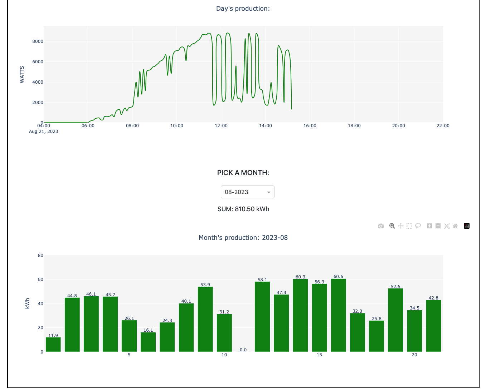
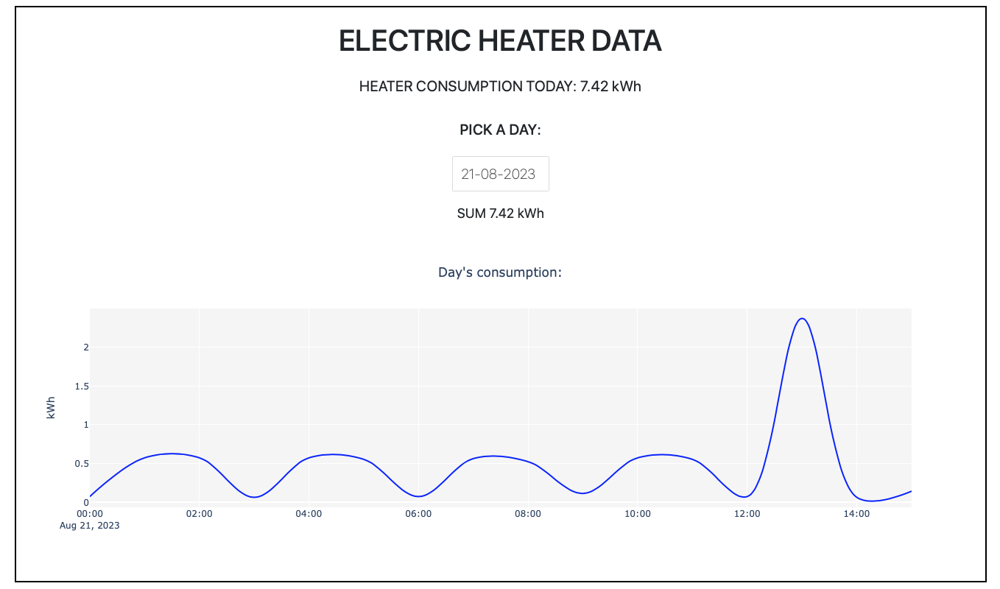
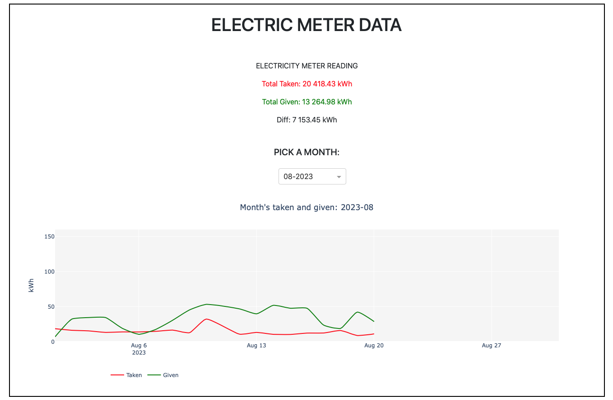
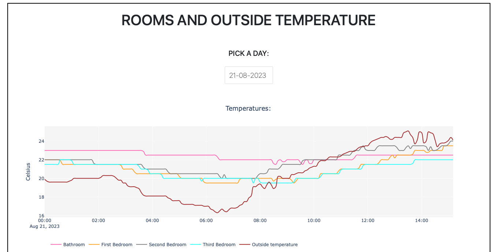

# House Energy Data Dashboard

The House Energy Data Dashboard is a data collection and visualization project that fetches data from various APIs and websites related to energy consumption and production. It stores the collected data in an SQLite database and presents it in an interactive web-based dashboard built using Plotly Dash. It is hosted on Raspberry Pi 4.

## Table of Contents

- [Description](#description)
- [Features](#features)
- [Data Sources](#data-sources)
- [File Organization](#file-organization)
- [Installation](#installation)
- [Usage](#usage)
- [Dependencies](#dependencies)


## Description

The House Energy Data Dashboard project aims to provide a centralized platform to collect, store, and visualize energy-related data. It combines data from different sources, including various APIs and energy provider websites, to offer a comprehensive view of energy consumption and production.

## Features

- Data Collection: The project fetches data from multiple APIs, including weather data, thermostat readings, electric stove submeter, and electricity production from photovoltaic systems.
- Web Scraping: It utilizes web scraping to extract meter readings from the energy provider's website on a daily basis.
- Data Storage: The collected data is stored in an SQLite database, allowing for efficient querying and data management.
- Dashboard Visualization: The data is presented on an interactive web-based dashboard using Dash, providing users with real-time insights into energy usage and production.
- Multi-Source Integration: The dashboard combines data from various sources, enabling analysis of correlations and patterns between different energy parameters.
- Telegram messages to inform about errors and project status

## Data Sources

The Energy Data Dashboard integrates data from the following sources:

- Weather API: Retrieves outside temperature data for the local area.
- Tuya Thermostats: Captures room temperatures for heating and cooling systems.
- Tuya Sub Meter: Measures the power consumption of the electric stove.
- Photovoltaic API: Fetches electricity production data from the photovoltaic system.
- Energy Provider Website: Daily web scraping to extract power meter readings.

## File Organization

The project is organized as follows:

- `app.py`: This is the main entry point for running the Dash app. It handles the server setup and routes for the web application.
- `backup.py`: Contains the code to create a backup of the database. It creates a backup of the `electricity.db` SQLite database and stores it in the `backup/` directory.
- `datafetcher.py`: This script is responsible for fetching data from various APIs, including the Weather API, Tuya Thermostats, Tuya Sub Meter, and Photovoltaic API. It stores the collected data in the `electricity.db` SQLite database.
- `house_energy.py`: A utility program to check if all the necessary components of the project are running. It ensures that the required services and scripts are active and functioning properly. It also checks wifi connection and reconnects if necessary.
- `message_sender.py`: Handles the functionality to send Telegram messages. It is used to deliver notifications or alerts related to the energy data or system status.
- `scraper.py`: This script is used to download data from the energy provider's website using web scraping. It extracts daily power meter readings and updates the database with the new values.
- `scraping_scheduler.py`: Schedules the running of `scraper.py` at specific intervals. It ensures that the scraper runs daily to keep the power meter readings up-to-date. It tries to download data every day at 12:00 PM and retries every hour if it fails to succeed.
- `requirements.txt`: This file lists all the required modules needed to run the project.
- `scraping_scheduler_logs.log`: Stores the logs generated by running `scraper.py`, providing a record of scheduled executions and their outcomes.
- `electricity.db`: The SQLite database file that stores all the collected energy data.
- `assets/`: This directory contains all the assets required for the Dash app, such as CSS and images.
- `backup/`: This directory holds the backup files created by `backup.py`.
- `logs/`: This directory can be used to store other log files generated by the project, if needed.

Each file in the project serves a specific purpose and contributes to the overall functionality of the House Energy Data Dashboard.

## Installation

To install and set up the House Energy Data Dashboard, follow these steps:

1. Clone the repository to your local machine.
2. Install the required dependencies listed in the `requirements.txt` file using `pip`.
3. Ensure you have the necessary credentials or access tokens for the APIs used and credentials for the power provider platform.
4. **Accessing the Dashboard Remotely**:
   - Since the dashboard is hosted on home computer, you may want to access it remotely from external devices.
   - To do this, I recommend using ngrok for port tunneling.
   - After installing ngrok, run the following command in your terminal to expose the local server to the internet:
     ```
     ngrok http <port_number>
     ```
     Replace `<port_number>` with the port number where your Dash app is running (e.g., 8050).

5. **Access the Dashboard**:
   - After running ngrok, you will be provided with a public URL. Access this URL from any device with an internet connection to view the dashboard remotely.

## Usage

To run the House Energy Data Dashboard, execute the `house_energy.py` script. It will run other necessary programs in this project and reload them if they fail.

On website you will see gauge chart showing live electric production:



Power production in selected day and month:



Electric heater consumption in selected day:



Power meter reads:



Outside and rooms temperature:



## Dependencies

The House Energy Data Dashboard relies on the following key dependencies:

- SQLAlchemy: Python SQL Toolkit and Object-Relational Mapper.
- SQLite: Lightweight, self-contained, serverless database engine.
- Selenium: Web browser automation tool for web scraping.
- webdriver: Used for web scraping with Selenium.
- Dash: Web framework for building interactive web applications in Python.
- pandas: Data manipulation and analysis library.
- plotly: Interactive visualization library for creating charts and graphs.
- tuya_connector: Library for interacting with Tuya devices and APIs.
- requests: Library for making HTTP requests, used for API calls.
- python-telegram-bot: Used for sending messages via telegram
- multiprocessing: Enables parallel processing and concurrent task management.
- schedule: Library for scheduling tasks.
- psutil: Used for system monitoring and resource utilization.
- dotenv: For managing environment variables.

Other dependencies are listed in the `requirements.txt` file.